# SSH Folder Sync Architecture

This document provides a comprehensive structural and behavioral overview of the SSH Folder Sync application (`v1.1.0`) utilizing Mermaid diagrams required by `GEMINI.md`.

---

<!-- START doctoc generated TOC please keep comment here to allow auto update -->
<!-- DON'T EDIT THIS SECTION, INSTEAD RE-RUN doctoc TO UPDATE -->
**Table of Contents**

- [Prerequisites](#prerequisites)
  - [1. C++ Compiler](#1-c-compiler)
  - [2. Install `libssh`](#2-install-libssh)
- [Building the Project](#building-the-project)
- [Usage](#usage)
  - [Required Arguments:](#required-arguments)
  - [Optional Arguments:](#optional-arguments)
  - [Notes](#notes)
- [The `.env` File Format](#the-env-file-format)
- [Example](#example)
- [📜 License](#-license)
- [📄 Changelog](#-changelog)
- [Author](#author)
- [Code Contributors](#code-contributors)

<!-- END doctoc generated TOC please keep comment here to allow auto update -->

---

## 1. Bounded Contexts
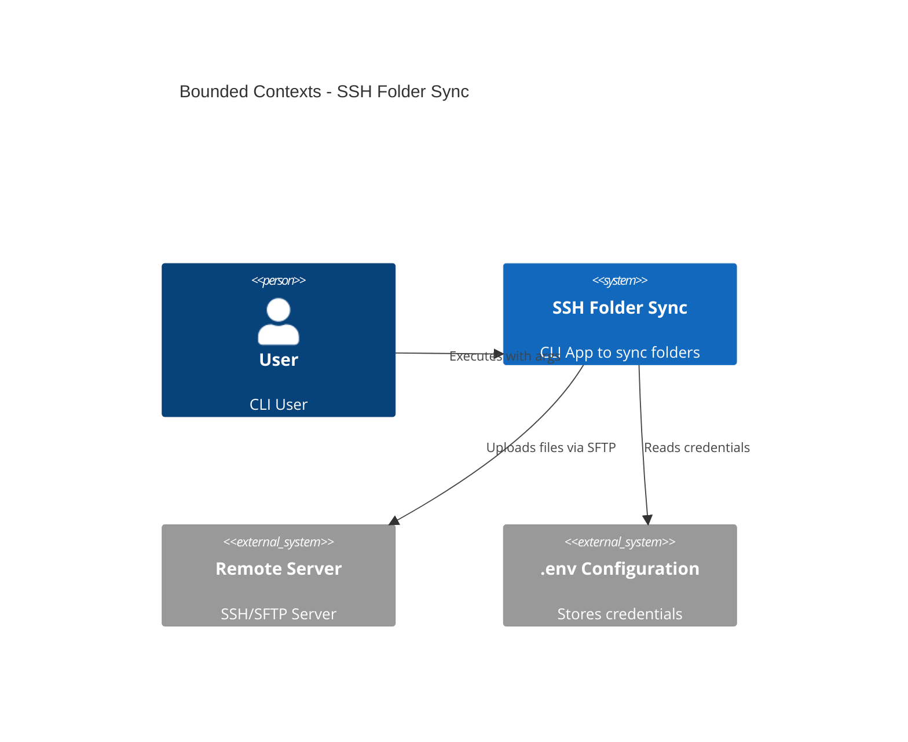

## 2. Class Diagram
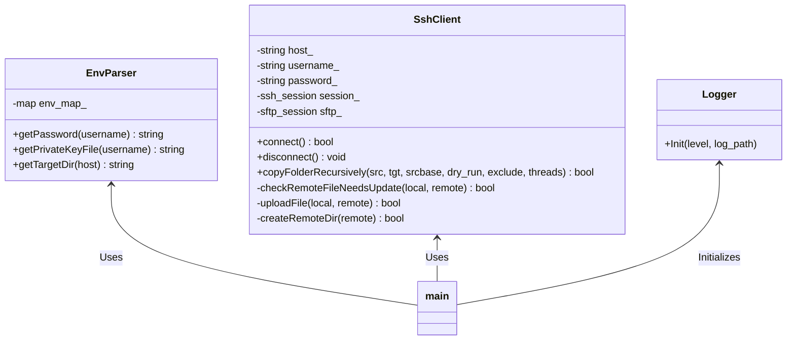

## 3. Sequence Diagram
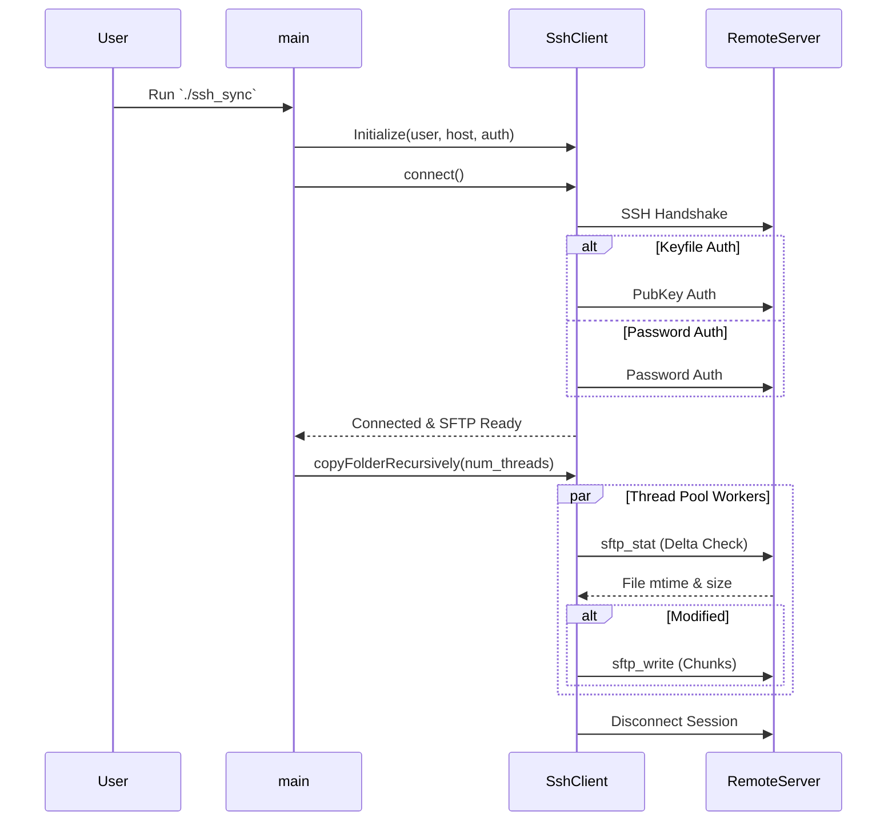

## 4. Activity Diagram
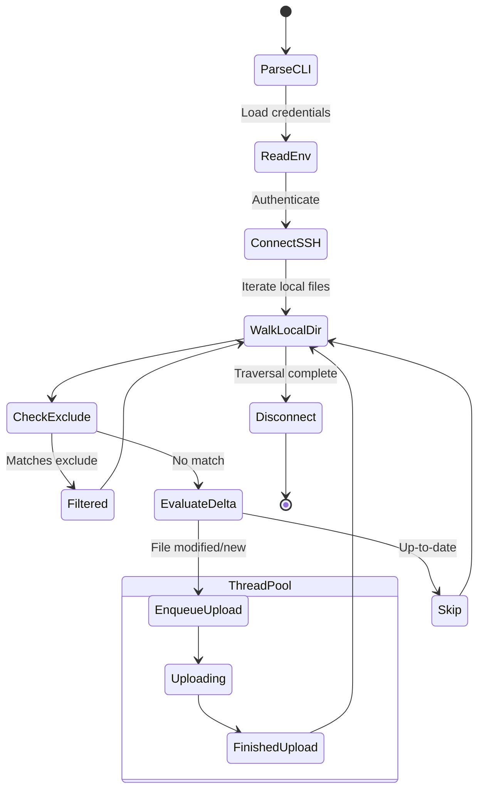

## 5. State Diagram
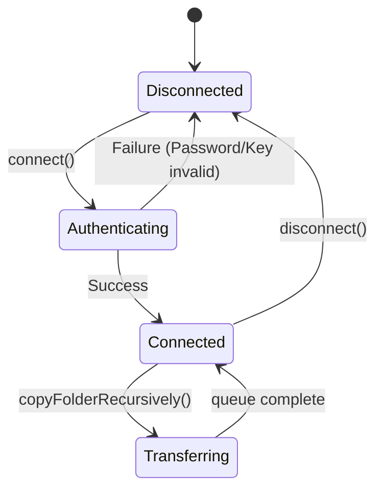

## 6. Component Diagram
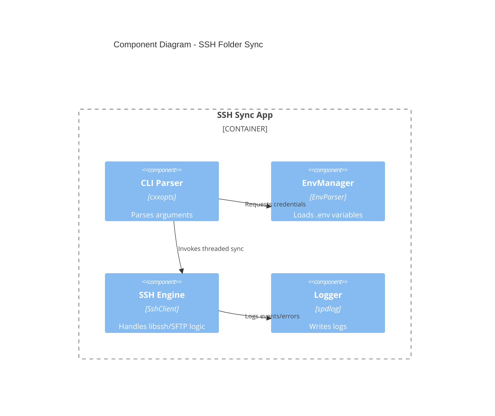

## 7. Deployment Diagram
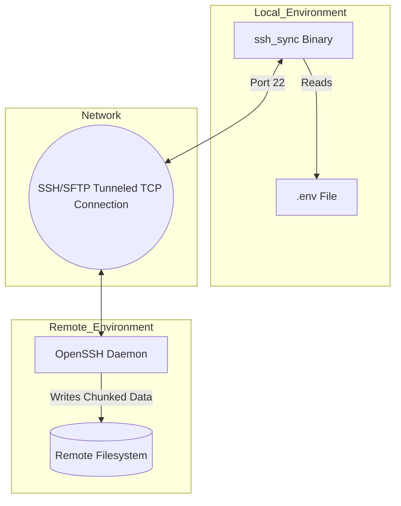

## 8. Use Case Diagram
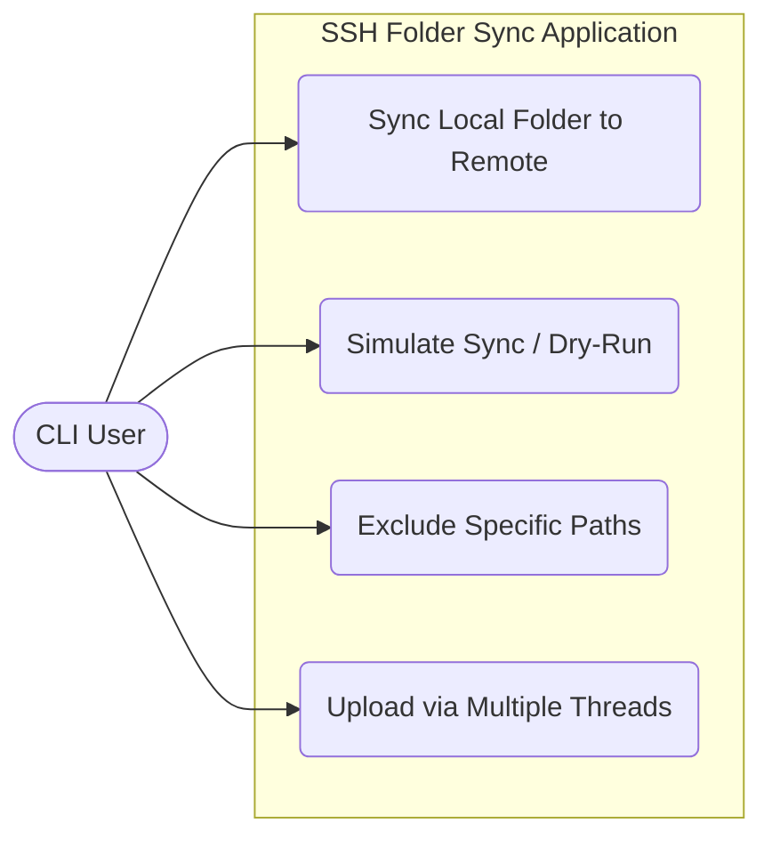

## 9. Entity Relationship Diagram
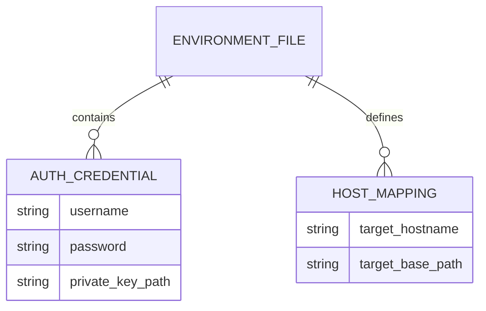

## 10. Flowchart
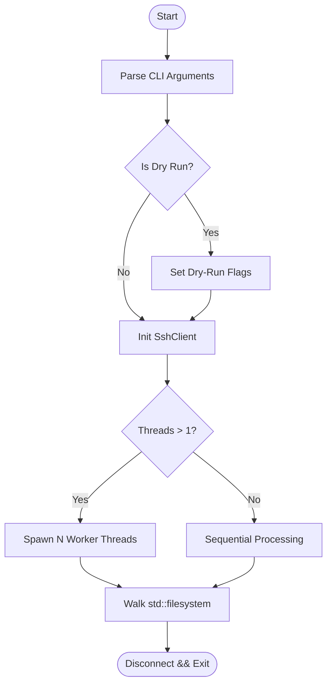

## 11. Functional Decomposition Diagram
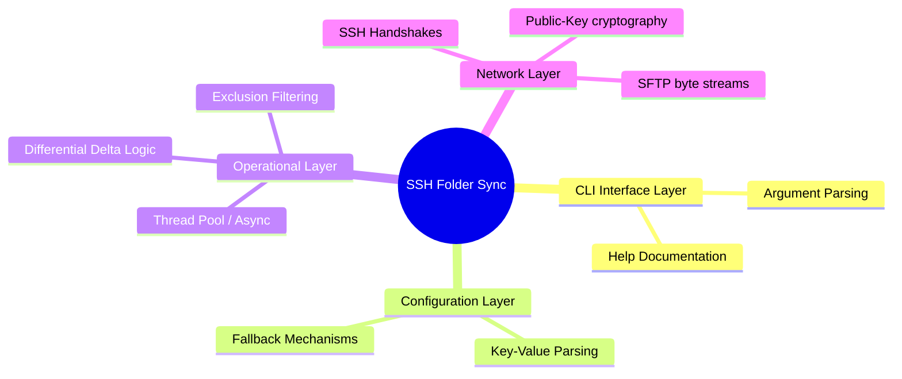

## 12. Information Flow Diagram
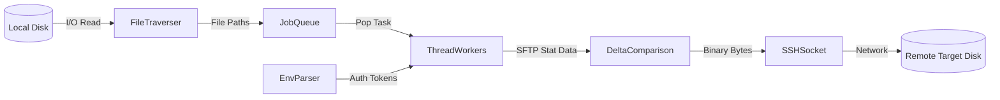

## 13. Logical Decomposition Diagram
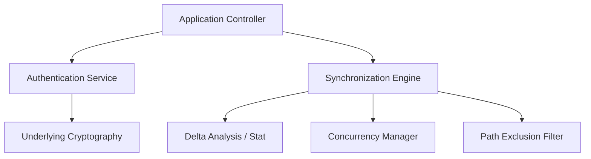

## 14. Physical Decomposition Diagram
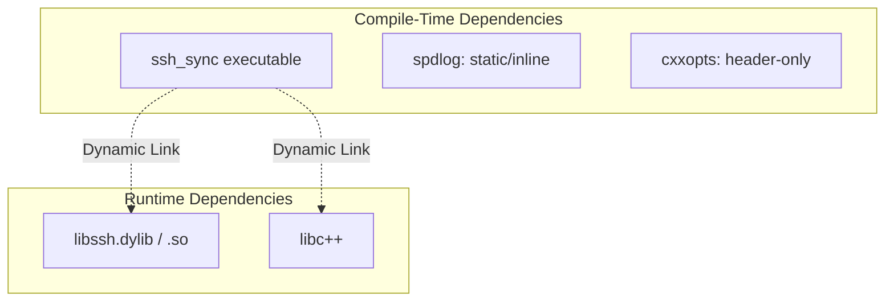

## 15. Development View
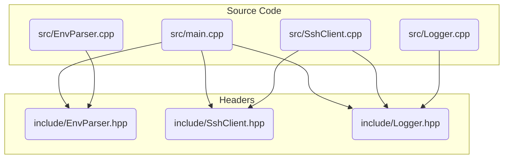

## 16. Deployment View
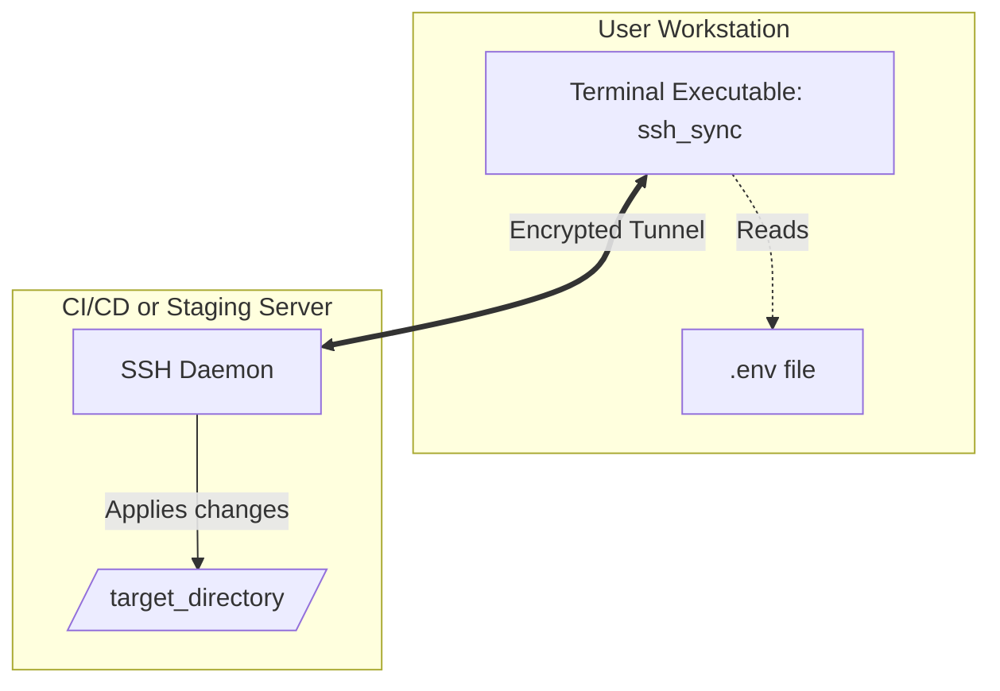
